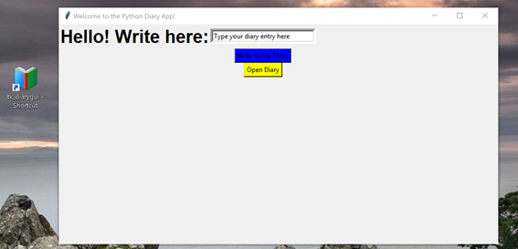
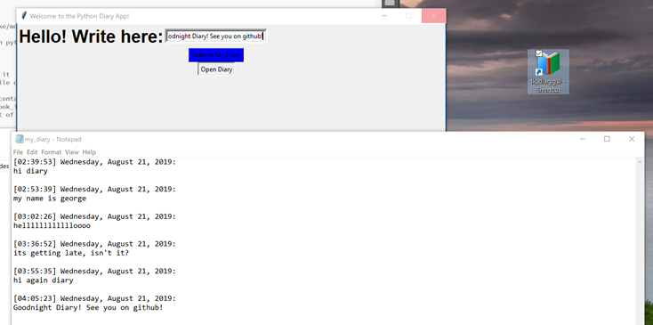

# Python Diary App using tkinter GUI
A python diary desktop application 

A fun diary application written in python using the tkinter GUI module. Meant to be as simple as possible to show how easy it is to create python desktop apps that might more often be made in JS. Only some basic python knowledge is required. 

Of course one could easily merge everything into one script but the purpose of this project is to show how we can create a flexible and modular GUI in python. 

We make a diary for a change of pace from the more common numerical application one might see in python 

Diary GUI and desktop shortcut:

Diary GUI used to make a diary entry and look at the diary:

## Dependencies
 * python 3 
 * pyinstaller 
    * Only if you want to make/modify your own app instead of running mine
 * tkinter
    * Should be installed with python, can just run 'pip install tkinter' otherwise 

## Running
### Run App
 * Just click the app (tk_diarygui.exe) to run it
    * Alternatively, go to file directory and type 'start tk_diarygui. 

### Build the App on your device: 
Navigate to directory containing the python scripts and enter the following commandto create an executable application:
pyinstaller -w -F -i book_icon.ico tk_diarygui.py
 * Drag the executable out of the dist directory and into your main diary_app directory
 * You can now run your .exe app from terminal or clicking on it
 * You can even make a desktop shortcut and run it from there!
    

### Run Python Codes 
 * python tk_diarygui.py 
    * initializes the GUI, can run the write2diary.py file just by writing in the text and clicking the blue 'write' button
 * python write2diary.py --input my_text_use_underscores_for_whitespaces
    * Don't need to run this, as mentioned above.
    * More annoying to use this, as we need to use underscores for spaces. Whereas in GUI we can just rite normally in the textbox
 * python strrep_example.py --input my_text_use_underscores_for_whitespaces
    * Just an example of the process we use to change underscores from the input into whitespaces
    * Do it this way to try and minimize the amount of code without having to input any text into anything other than the GUI, the whole point is to interact with a GUI not the terminal 

book_icon.ico is the icon image for the app when we put it on the desktop homepage

## Options

Enable the following buttons:
    * btn1 - responsive button that thanks the user for their writing, but does nothing else
    * btn4 - runs createnewdiary() function allowing you to create and name a new txt file 
    * my_btn - button template that runs your custom script. Create your script as my_script1.py, uncomment and define the my_script1() function according to the specifics of your script
    

Substitute 'write2diary_withoutdate.py' for 'write2diary.py' in the diarywrite() function definition section

## To Do 
Need a username/password to write in this diary, use tkinter username/password functions 

Can make it so we select diary to write to from a dropdown menu  with combo option in tkinter:
combo = Combobox(window) 
combo['values']= (1, 2, 3, 4, 5, "Text")
combo.current(1) #set the selected item
combo.grid(column=1, row=8)

## Possible issues 
'notepad' command doesn't necessarily work on all systems. If not just replace "notepad" in under diaryopen() function definition with the command to open text files present on your system/environment

Build not included in github repo due to upload size restrictions, should work fine without. If you encounter problems running the app simply build the app on your own system (see 'Build the App on your device' section ). Python files should still run as described. 

## Misc 
We use append option "a" to write to the file so we dont erase previous entries, replace with "w" to erase and rewrite entire diary. 

We make executable using pyinstaller, you can use any you'd like  
